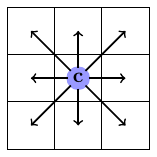
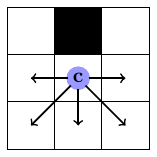
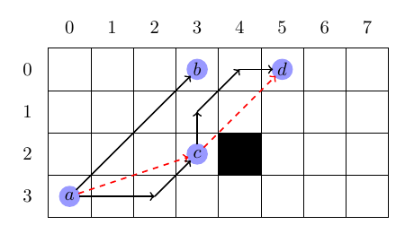

# Problem statement
Your task is to find a path on a given graph, and the solution is evaluated based on optimality, time performance and space cost.

## Definition: Graph
The input graph is an 8-connected grid map, i.e. each cell (`c`) has 8 adjacent neighbours:

The distance to cardinal neighbours (`N,S,W,E`) is 1, the distance to diagonal neighbours (`NE,NW,SW,SE`) `sqrt(2)`.

Each cell is either traversable or obstacle, **corner cutting is not allowed**:

## Definition: Path

For a query `<s, t>`, a valid path is a sequence of nodes `p=<s,v1,...vn,t>`, any adjacent nodes `<a, b>`on the path must be a **valid segment**, i.e. strictly in a cardinal or ordinal direction, for example:

* From `a` to `b` needs 3 ordinal moves (`North-East`), so `<a, b>` is a valid segment
* From `a` to `c` needs 1 ordinal move (`North-East`) and 2 cardinal moves (`East`), so `<a, c>` is not a valid segment;
* From `c` to `d`, the first diagonal move from `c` is forbidden due to the **no corner-cutting** rule, so `<c, d>` is not a valid segment;

**When start and target are same node, the path must be empty, the length must be `0`.**
